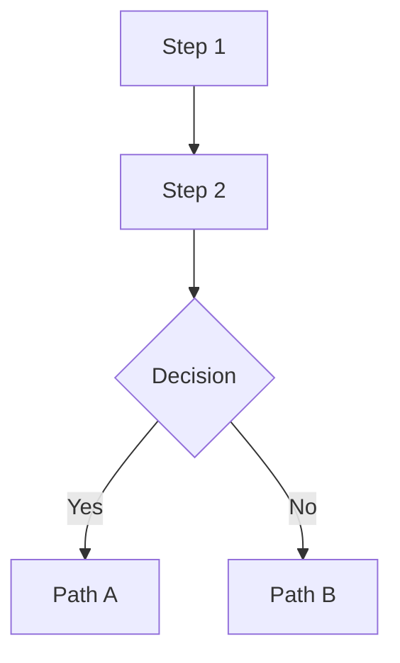
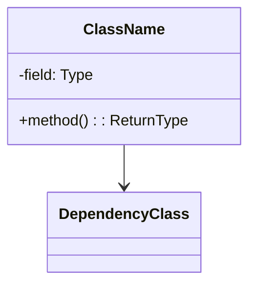
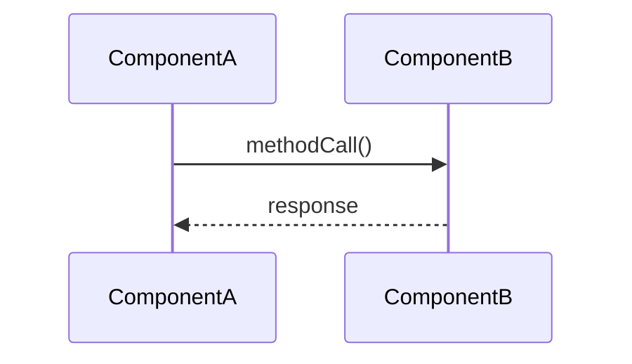
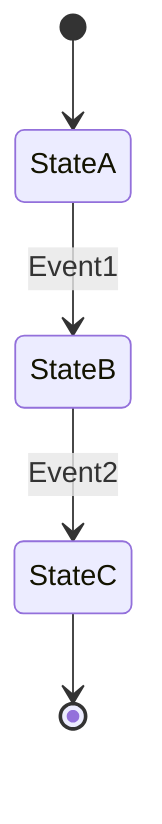

# Analyze Changes

Analyze the git changes specified by the argument and produce a detailed markup document.

## Input

The argument `$ARGUMENTS` is either:
- **Empty / not provided** — analyze the **current branch** compared to `develop`
- A **commit SHA** (short or full) — analyze that single commit
- A **branch name** — analyze all commits on that branch relative to `develop`

## Steps

### 1. Determine the input type and gather changes

If `$ARGUMENTS` is empty or blank, get the current branch name:
```bash
git rev-parse --abbrev-ref HEAD
```
Then treat it as a branch name (see branch handling below).

Otherwise, run these git commands to figure out what was provided:
```bash
git cat-file -t "$ARGUMENTS" 2>/dev/null
git branch --list "$ARGUMENTS"
```

- If it resolves to a **commit** and is not a branch name (`git branch --list "$ARGUMENTS"` is empty), treat it as a single commit SHA. Gather:
  - `git show --stat <SHA>`
  - `git diff <SHA>~1..<SHA>` (the full diff)
  - `git log -1 --format="%H%n%s%n%b" <SHA>` (commit message)

- If it resolves to a **branch**, gather:
  - `git log --oneline develop..<branch>` (all commits on the branch)
  - `git diff develop...<branch>` (combined diff)
  - `git log --format="%H%n%s%n%b%n---" develop..<branch>` (all commit messages)

### 2. Check for an associated Pull Request

Use `gh` to find a PR associated with the branch or commit:

```bash
# For a branch:
gh pr list --head "<branch-name>" --json number,title,body,comments,reviews,url --limit 1

# For a commit (search PRs that contain the SHA):
gh pr list --search "<SHA>" --state all --json number,title,body,comments,reviews,url --limit 1
```

If a PR is found:
- Read the PR **title**, **description/body**, and **URL**
- Read all **review comments** and **issue comments** via:
  ```bash
  gh pr view <number> --json comments,reviews,reviewDecision # Fetches top-level issue comments, review summaries, and decision
  gh api repos/{owner}/{repo}/pulls/<number>/comments # Fetches detailed line-level review comments
  ```
- Include the PR context in your analysis

### 3. Read all changed files at their final state

For every file that was added or modified in the diff, use the `Read` tool to read the final version of the file. This is essential for providing accurate line number references. Read the full file contents so you can reference specific line numbers.

### 4. Analyze the changes

Study the diff, commit messages, PR description, and PR comments carefully. Identify:

- **Purpose**: What is the overall goal of these changes?
- **Architecture impact**: Are new classes, interfaces, or modules introduced? Are existing patterns changed?
- **Non-trivial sections**: Complex algorithms, concurrency changes, data structure changes, performance optimizations, protocol changes, etc.
- **Trivial sections**: Simple renames, formatting, import changes, minor config tweaks

### 5. Generate the markup document

Create a file named `changes-analysis-<identifier>.md` in the project root directory, where `<identifier>` is the short SHA or branch name (sanitized for filenames — replace `/` with `-`).

The document MUST follow this structure:

```markdown
# Change Analysis: <short description>

**Ref**: `<SHA or branch name>`
**PR**: [#<number> <title>](<url>) *(if PR exists, omit section if no PR)*
**Date**: <commit date(s)>
**Author**: <author(s)>

## Summary

<2-5 sentence high-level summary of what these changes accomplish and why.>

## Changed Files

| File | Change Type | Lines Changed | Description |
|------|------------|---------------|-------------|
| `path/to/file` | Added/Modified/Deleted | +X / -Y | Brief description |

## Detailed Analysis

### <Section title for a logical group of changes>

<Detailed explanation of what changed and why. Reference specific source code locations using the format `path/to/File.java:42` with line numbers from the final state of the files.>

<For non-trivial changes, include one or more Mermaid diagrams. Choose the appropriate diagram type:>

#### Flow Diagram


#### Class Diagram


#### Sequence Diagram


#### State Diagram


<Repeat sections for each logical group of non-trivial changes.>

### Trivial Changes

<Brief list of trivial changes (formatting, imports, renames) that don't warrant detailed analysis. Still reference file:line.>

## PR Discussion Summary

*(Only if a PR with comments exists)*

<Summarize key points from PR comments and reviews. Note any decisions made, concerns raised, or alternatives discussed.>

## Impact Assessment

- **Risk level**: Low / Medium / High
- **Affected components**: <list>
- **Testing considerations**: <what should be tested>
- **Backward compatibility**: <any breaking changes?>
```

### Important Rules

1. **Every code reference MUST include line numbers** in the format `path/to/File.java:42` or `path/to/File.java:42-58` for ranges. Use line numbers from the FINAL state of the files (as read by the Read tool), not from the diff.
2. **Mermaid diagrams are REQUIRED** for any non-trivial change. Use:
   - **Flowchart** for control flow, algorithms, or process changes
   - **Class diagram** for new/modified class hierarchies or relationships
   - **Sequence diagram** for interaction patterns between components
   - **State diagram** for state machine changes
   - Skip diagrams ONLY for truly trivial changes (formatting, typo fixes, simple config changes)
3. **Group related changes** into logical sections rather than going file-by-file
4. **Explain WHY**, not just what. Use commit messages and PR description for motivation context
5. **Use the Agent tool** with `subagent_type: "Explore"` if you need to understand surrounding code context that isn't in the diff
6. The output file goes in the **project root directory** (the current working directory)
